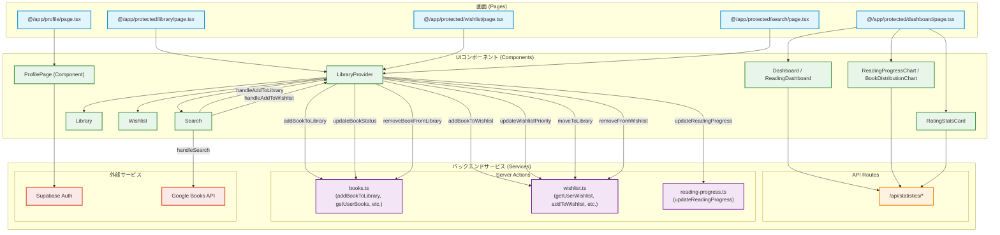

# アプリケーション概要図

```mermaid
graph TD
    subgraph "画面 (Pages)"
        direction LR
        DashboardPage["@/app/protected/dashboard/page.tsx"]
        LibraryPage["@/app/protected/library/page.tsx"]
        WishlistPage["@/app/protected/wishlist/page.tsx"]
        SearchPage["@/app/protected/search/page.tsx"]
        ProfilePage["@/app/profile/page.tsx"]
    end

    subgraph "UIコンポーネント (Components)"
        direction LR
        DashboardComp["Dashboard / ReadingDashboard"]
        Charts["ReadingProgressChart / BookDistributionChart"]
        RatingCard["RatingStatsCard"]
        LibraryComp["Library"]
        WishlistComp["Wishlist"]
        SearchComp["Search"]
        ProfileComp["ProfilePage (Component)"]
        LibraryProvider["LibraryProvider"]
    end

    subgraph "バックエンドサービス (Services)"
        direction LR
        subgraph "API Routes"
            StatsAPI["/api/statistics/*"]
        end
        subgraph "Server Actions"
            BookActions["books.ts<br>(addBookToLibrary, getUserBooks, etc.)"]
            WishlistActions["wishlist.ts<br>(getUserWishlist, addToWishlist, etc.)"]
            ProgressActions["reading-progress.ts<br>(updateReadingProgress)"]
        end
        subgraph "外部サービス"
            SupabaseAuth["Supabase Auth"]
            GoogleBooks["Google Books API"]
        end
    end

    %% スタイル定義
    classDef page fill:#E1F5FE,stroke:#0288D1,stroke-width:2px;
    classDef component fill:#E8F5E9,stroke:#388E3C,stroke-width:2px;
    classDef api fill:#FFF3E0,stroke:#F57C00,stroke-width:2px;
    classDef sa fill:#F3E5F5,stroke:#7B1FA2,stroke-width:2px;
    classDef external fill:#FBE9E7,stroke:#D84315,stroke-width:2px;

    class DashboardPage,LibraryPage,WishlistPage,SearchPage,ProfilePage page;
    class DashboardComp,Charts,RatingCard,LibraryComp,WishlistComp,SearchComp,ProfileComp,LibraryProvider component;
    class StatsAPI api;
    class BookActions,WishlistActions,ProgressActions sa;
    class SupabaseAuth,GoogleBooks external;

    %% 画面とコンポーネントの接続
    DashboardPage --> DashboardComp
    DashboardPage --> Charts
    DashboardPage --> RatingCard
    LibraryPage --> LibraryProvider
    WishlistPage --> LibraryProvider
    SearchPage --> LibraryProvider
    LibraryProvider --> LibraryComp
    LibraryProvider --> WishlistComp
    LibraryProvider --> SearchComp
    ProfilePage --> ProfileComp

    %% コンポーネントとサービスの接続
    DashboardComp --> StatsAPI
    Charts --> StatsAPI
    RatingCard --> StatsAPI

    SearchComp -- "handleSearch" --> GoogleBooks
    SearchComp -- "handleAddToLibrary" --> LibraryProvider
    SearchComp -- "handleAddToWishlist" --> LibraryProvider

    LibraryProvider -- "addBookToLibrary" --> BookActions
    LibraryProvider -- "updateBookStatus" --> BookActions
    LibraryProvider -- "removeBookFromLibrary" --> BookActions
    LibraryProvider -- "updateReadingProgress" --> ProgressActions
    LibraryProvider -- "addBookToWishlist" --> WishlistActions
    LibraryProvider -- "updateWishlistPriority" --> WishlistActions
    LibraryProvider -- "moveToLibrary" --> WishlistActions
    LibraryProvider -- "removeFromWishlist" --> WishlistActions

    ProfileComp --> SupabaseAuth
```
