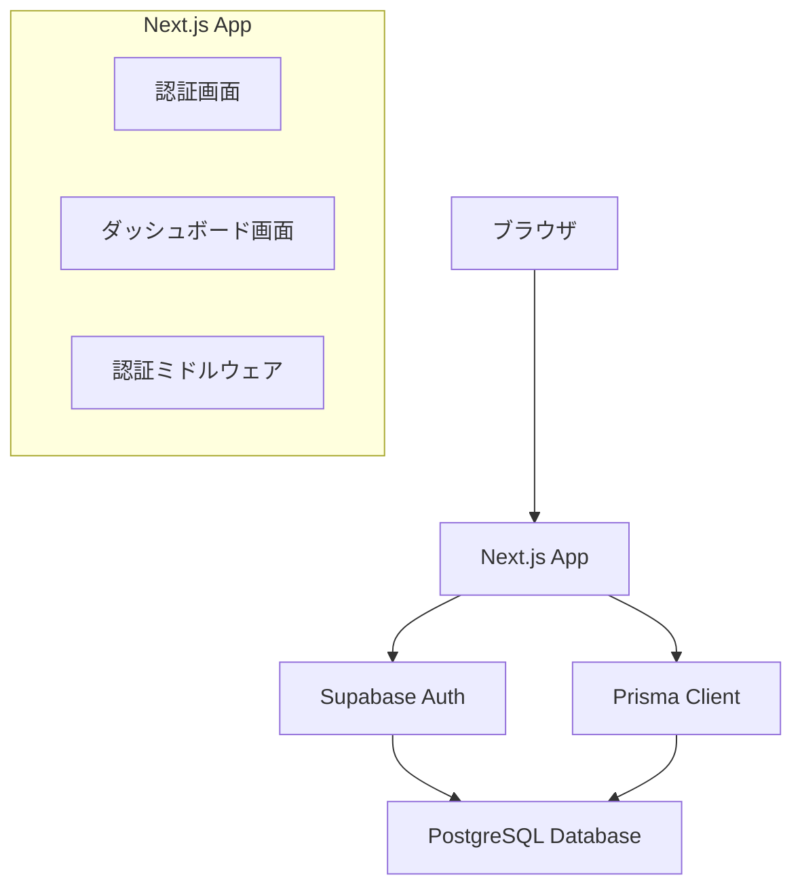

# 設計ドキュメント

## 概要

Next.js、Prisma、Supabase、PostgreSQLを使用した基本認証機能の設計です。Supabase Authを活用してメール認証とGoogle認証の2つの認証方式をサポートするセキュアで拡張性のある認証システムを構築します。

## アーキテクチャ

### 技術スタック
- **フロントエンド**: Next.js 15 (App Router)
- **認証**: Supabase Auth
- **データベース**: PostgreSQL (Supabase)
- **ORM**: Prisma
- **クライアントライブラリ**: @supabase/supabase-js

### アーキテクチャ図



## コンポーネントとインターフェース

### 1. 認証コンポーネント

#### LoginForm コンポーネント
- メールアドレスとパスワードの入力フィールド
- Googleログインボタン
- バリデーション機能
- メール認証とGoogle認証の処理実行
- エラーハンドリング

#### SignUpForm コンポーネント
- 新規ユーザー登録フォーム（メール認証用）
- パスワード強度チェック
- 重複メール確認
- Google認証では自動的にアカウント作成

### 2. 認証フック

#### useAuth カスタムフック
```typescript
interface AuthUser {
  id: string;
  email: string;
  created_at: string;
}

interface UseAuthReturn {
  user: AuthUser | null;
  loading: boolean;
  signIn: (email: string, password: string) => Promise<void>;
  signInWithGoogle: () => Promise<void>;
  signUp: (email: string, password: string) => Promise<void>;
  signOut: () => Promise<void>;
}
```

### 3. ページコンポーネント

#### 認証画面 (/auth)
- メール認証ログインフォーム
- Googleログインボタン
- 新規登録フォーム（メール認証用）
- タブ切り替え機能

#### ダッシュボード画面 (/dashboard)
- ユーザー情報表示
- ログアウト機能
- 認証保護

### 4. ミドルウェア

#### 認証ミドルウェア
- 認証状態の確認
- 未認証ユーザーのリダイレクト
- 保護されたルートの管理

## データモデル

### Supabase Auth テーブル
Supabaseの標準認証テーブルを使用：
- `auth.users`: ユーザー基本情報
- `auth.sessions`: セッション管理

### 追加のユーザープロファイルテーブル（必要に応じて）
```sql
-- Prisma Schema
model UserProfile {
  id         String   @id @default(uuid())
  user_id    String   @unique
  email      String   @unique
  created_at DateTime @default(now())
  updated_at DateTime @updatedAt
  
  @@map("user_profiles")
}
```

## エラーハンドリング

### 認証エラーの種類
1. **無効な認証情報**: "メールアドレスまたはパスワードが正しくありません"
2. **ネットワークエラー**: "接続に問題が発生しました。再度お試しください"
3. **重複メール**: "このメールアドレスは既に使用されています"
4. **パスワード要件不足**: "パスワードは8文字以上である必要があります"
5. **Google認証エラー**: "Google認証に失敗しました。再度お試しください"
6. **Google認証キャンセル**: "Google認証がキャンセルされました"

### エラー表示方法
- フォーム下部にエラーメッセージを表示
- 適切なアクセシビリティ属性を設定
- 自動的にエラーメッセージをクリア

## テスト戦略

### 単体テスト
- 認証フックのテスト
- フォームバリデーションのテスト
- エラーハンドリングのテスト

### 統合テスト
- ログインフローのテスト
- 新規登録フローのテスト
- 認証状態の永続化テスト

### E2Eテスト
- 完全な認証フローのテスト
- ページ遷移のテスト
- セッション管理のテスト

## セキュリティ考慮事項

### 1. パスワードセキュリティ
- Supabase Authによる自動ハッシュ化
- 最小8文字のパスワード要件
- パスワード強度の推奨

### 2. セッション管理
- JWTトークンによる認証
- 自動トークンリフレッシュ
- 適切な有効期限設定

### 3. CSRF対策
- Next.jsの標準CSRF保護
- SameSite Cookieの使用

### 4. XSS対策
- 入力値のサニタイゼーション
- Content Security Policy (CSP)の設定

## 実装の詳細

### 環境変数設定
```env
NEXT_PUBLIC_SUPABASE_URL=your_supabase_url
NEXT_PUBLIC_SUPABASE_ANON_KEY=your_supabase_anon_key
DATABASE_URL=your_database_url
# Google認証用
NEXT_PUBLIC_GOOGLE_CLIENT_ID=your_google_client_id
```

### Supabase クライアント設定
```typescript
import { createClient } from '@supabase/supabase-js'

const supabaseUrl = process.env.NEXT_PUBLIC_SUPABASE_URL!
const supabaseAnonKey = process.env.NEXT_PUBLIC_SUPABASE_ANON_KEY!

export const supabase = createClient(supabaseUrl, supabaseAnonKey)
```

### 認証状態の管理
- React Context APIを使用
- ローカルストレージでの永続化
- 自動ログアウト機能

## パフォーマンス考慮事項

### 1. 初期読み込み最適化
- 認証状態の早期確認
- 必要最小限のJavaScript読み込み

### 2. ルーティング最適化
- 認証状態に基づく条件付きレンダリング
- 適切なプリフェッチ設定

### 3. キャッシュ戦略
- 認証状態のメモ化
- 不要な再レンダリングの防止