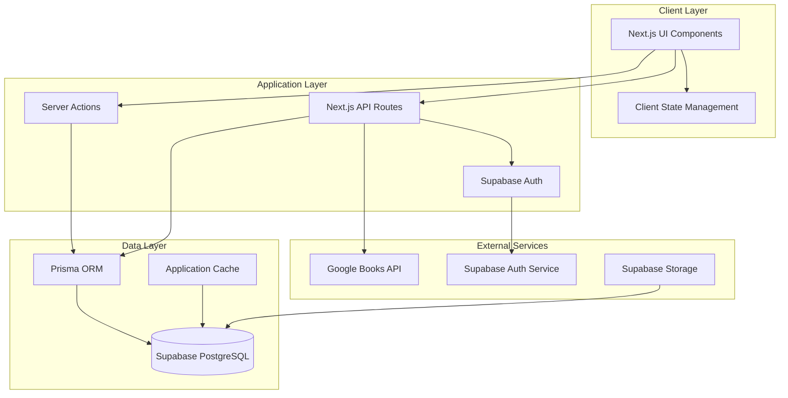

# hontodana アーキテクチャ設計

## システム概要

hontodanaは、個人の書籍管理を目的としたWebアプリケーションです。物理書籍とKindle電子書籍を統合的に管理し、読書進捗の記録・可視化を行います。本好きのユーザーが自分の読書ライフを楽しく管理できるモダンなWebアプリケーションです。

## アーキテクチャパターン

- **パターン**: JAMstack (JavaScript + APIs + Markup) アーキテクチャ
- **理由**: 
  - 高速なパフォーマンス
  - スケーラビリティ
  - セキュリティの向上
  - メンテナンス性の向上
  - 既存技術スタック（Next.js, Supabase）との親和性

## コンポーネント構成

### フロントエンド
- **フレームワーク**: Next.js 15.3.5 (App Router)
- **言語**: TypeScript 5
- **UIライブラリ**: shadcn/ui (Radix UI ベース)
- **スタイリング**: Tailwind CSS 4
- **アニメーション**: GSAP
- **状態管理**: React Server Components + Next.js App Router (サーバーサイド状態管理)
- **クライアント状態**: React hooks (useState, useReducer) + Context API

### バックエンド
- **フレームワーク**: Next.js API Routes + Server Actions
- **認証方式**: Supabase Auth (OAuth, Email認証)
- **ORM**: Prisma
- **外部API**: Google Books API

### データベース
- **DBMS**: PostgreSQL (Supabase)
- **ホスティング**: Supabase Database
- **キャッシュ戦略**: 
  - ブラウザキャッシュ (静的リソース)
  - API レスポンスキャッシュ (Next.js)
  - データベースコネクションプール (Supabase)

### 外部サービス連携
- **書籍情報API**: Google Books API
- **認証基盤**: Supabase Auth
- **データベース**: Supabase Database
- **ストレージ**: Supabase Storage (書籍画像等)

## アーキテクチャ図

## セキュリティアーキテクチャ

### 認証・認可
- **認証**: Supabase Auth による JWT認証
- **セッション管理**: HTTPOnly cookies + CSRF protection
- **API保護**: Route middleware による認証チェック
- **ロールベースアクセス制御**: Supabase RLS (Row Level Security)

### データ保護
- **通信暗号化**: HTTPS/TLS 1.3
- **データ暗号化**: Supabase による透過的暗号化
- **入力検証**: Zod スキーマバリデーション
- **SQL インジェクション対策**: Prisma ORM による自動エスケープ

## パフォーマンス戦略

### フロントエンド最適化
- **コード分割**: Next.js Automatic Code Splitting
- **画像最適化**: Next.js Image Optimization
- **キャッシュ戦略**: Static Generation + ISR (Incremental Static Regeneration)
- **CDN**: Vercel Edge Network

### バックエンド最適化
- **データベース最適化**: インデックス設計、クエリ最適化
- **コネクションプール**: Supabase Connection Pooling
- **API キャッシュ**: Next.js API Routes キャッシュ
- **レート制限**: API rate limiting implementation

## 拡張性とメンテナンス

### スケーラビリティ
- **水平スケーリング**: Vercel Serverless Functions
- **データベーススケーリング**: Supabase auto-scaling
- **CDN活用**: グローバル配信最適化

### 保守性
- **型安全性**: TypeScript による静的型検査
- **テスト**: Jest + React Testing Library
- **コード品質**: ESLint + Prettier + Biome
- **CI/CD**: GitHub Actions
- **監視**: Vercel Analytics + Supabase Monitoring

## デプロイメント戦略

### 環境構成
- **開発環境**: Local development (Next.js dev server)
- **ステージング環境**: Vercel Preview Deployments
- **本番環境**: Vercel Production Deployment

### デプロイフロー
1. GitHub への push
2. Vercel による自動ビルド・デプロイ
3. Supabase migrations 実行
4. 本番環境での動作確認

## 技術的制約と考慮事項

### Google Books API制約
- **レート制限**: 1000 requests/day/user
- **データ制限**: 公開データのみ取得可能
- **対応策**: キャッシュ戦略 + graceful degradation

### Supabase制約
- **無料プラン制限**: 
  - データベース容量: 500MB
  - 認証ユーザー数: 50,000
  - API リクエスト数: 500,000/month
- **対応策**: 効率的なクエリ設計 + データ最適化

### Next.js制約
- **Serverless制約**: 関数実行時間制限
- **対応策**: 非同期処理設計 + バックグラウンド処理