# データフロー図

## ユーザーインタラクションフロー

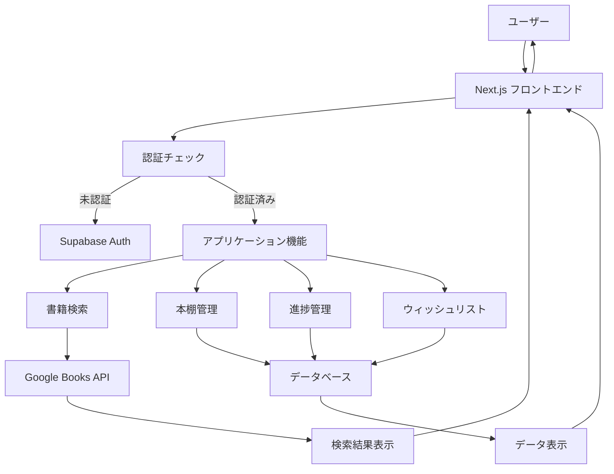

## データ処理フロー

### 書籍検索フロー
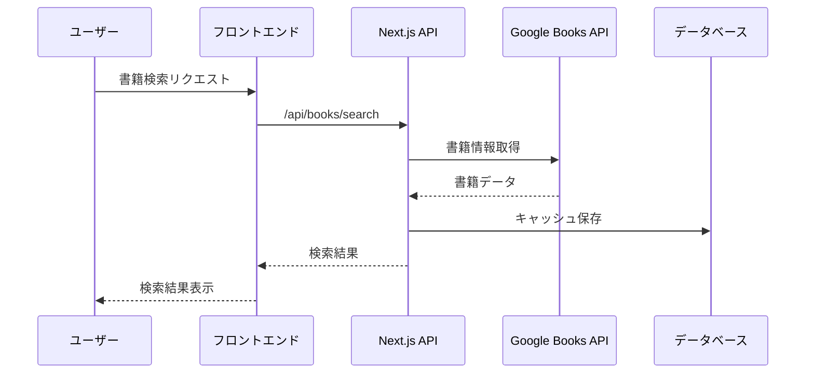

### 書籍登録フロー
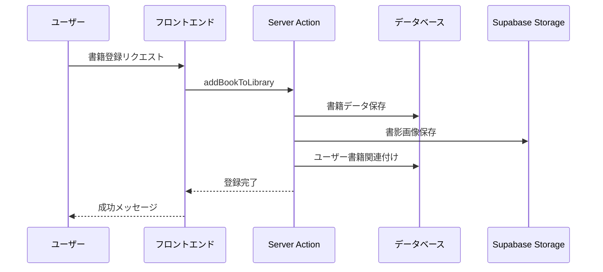

### 読書進捗更新フロー
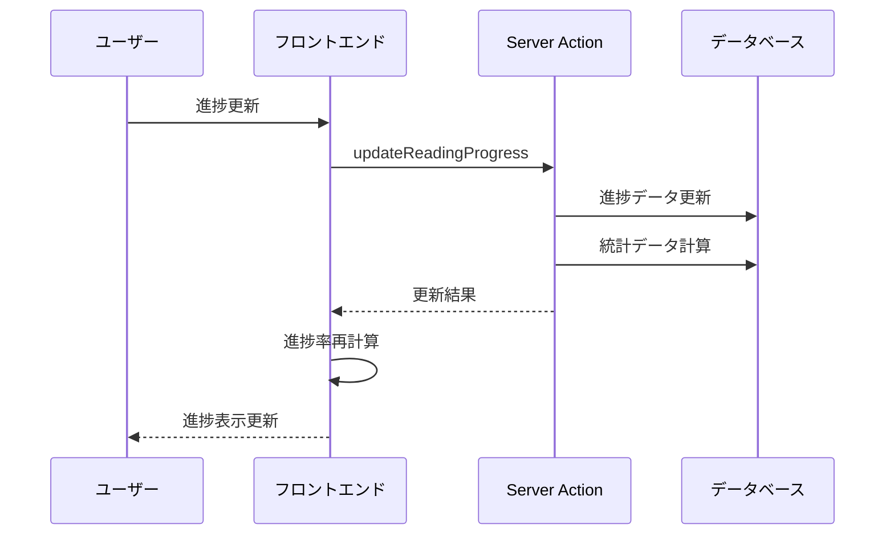

## システム内部データフロー

### 認証フロー
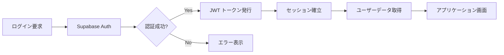

### データ同期フロー
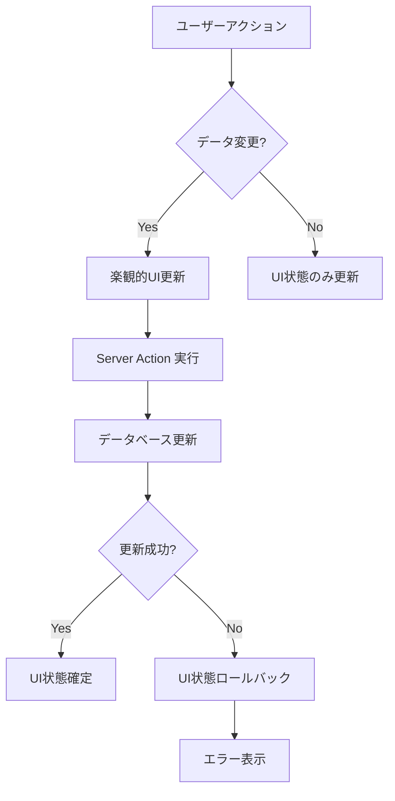

## 外部API統合フロー

### Google Books API統合
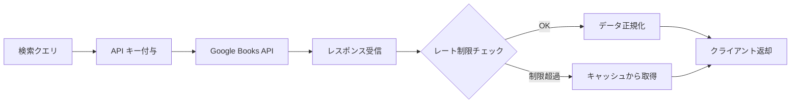

## リアルタイム更新フロー

### 統計データ更新
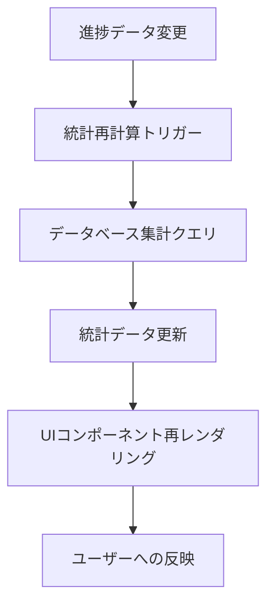

## エラーハンドリングフロー

### API エラー処理
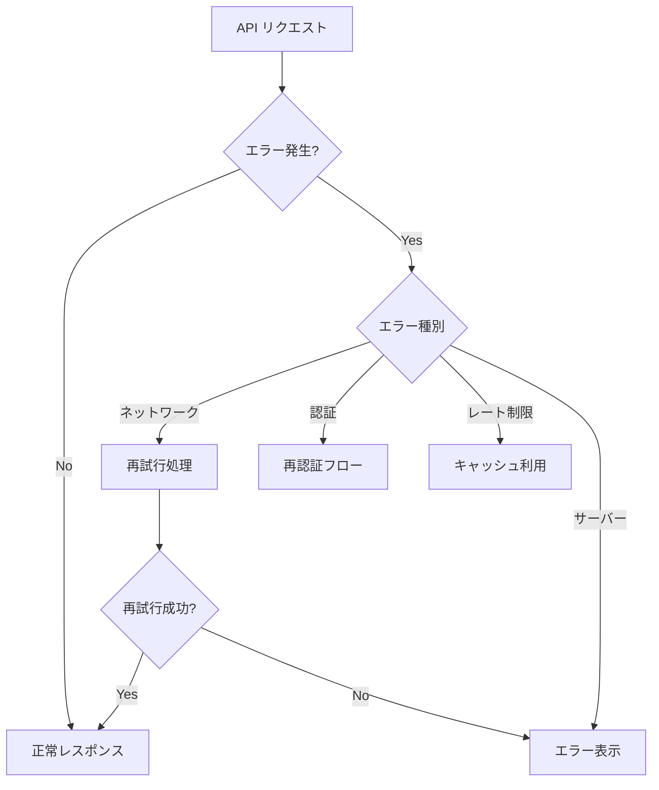

## パフォーマンス最適化フロー

### キャッシュ戦略
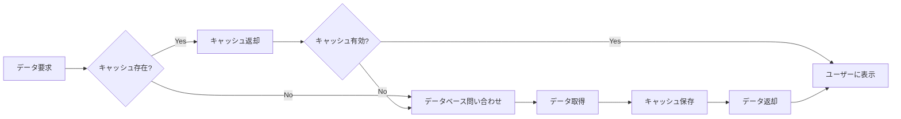

## セキュリティフロー

### 認可チェックフロー
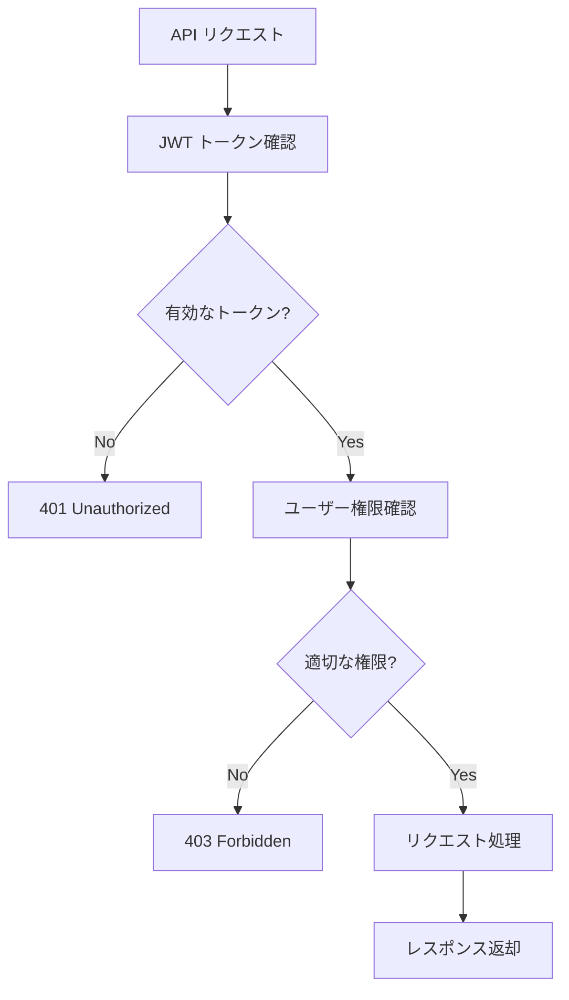

## モバイル対応フロー

### レスポンシブ表示フロー
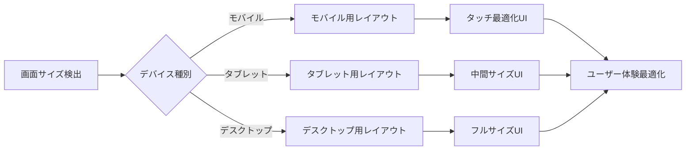