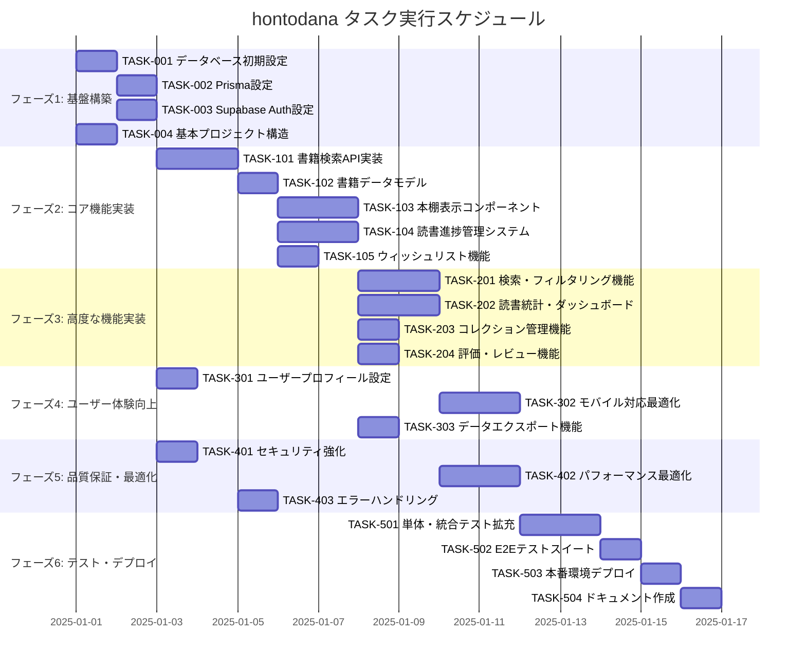

# hontodana 実装タスク

## 概要

全タスク数: 28
推定作業時間: 16-20日
クリティカルパス: TASK-001 → TASK-002 → TASK-003 → TASK-101 → TASK-201 → TASK-301

## タスク一覧

### フェーズ1: 基盤構築

#### TASK-001: データベース初期設定

- [x] **タスク完了**
- **タスクタイプ**: DIRECT
- **要件リンク**: REQ-401
- **依存タスク**: なし
- **実装詳細**:
  - Supabase プロジェクトの初期化
  - PostgreSQL データベースの設定
  - データベーススキーマの作成（docs/design/hontodana/database-schema.sql を適用）
  - RLS (Row Level Security) の設定
  - 各テーブルの作成とインデックス設定
- **テスト要件**:
  - [ ] データベース接続テスト
  - [ ] スキーマ検証テスト
  - [ ] RLS ポリシーの動作確認
- **完了条件**:
  - [ ] 全テーブルが作成されている
  - [ ] RLS が正常に動作している
  - [ ] 必要なインデックスが設定されている

#### TASK-002: Prisma設定とマイグレーション

- [x] **タスク完了**
- **タスクタイプ**: DIRECT
- **要件リンク**: REQ-001, REQ-002
- **依存タスク**: TASK-001
- **実装詳細**:
  - Prisma スキーマの定義（schema.prisma）
  - データベース接続文字列の設定
  - Prisma Client の生成
  - マイグレーション設定
  - 型定義の自動生成
- **テスト要件**:
  - [ ] Prisma Client の接続テスト
  - [ ] マイグレーション実行テスト
  - [ ] 型定義の検証
- **完了条件**:
  - [ ] Prisma スキーマが定義されている
  - [ ] マイグレーションが正常に実行される
  - [ ] TypeScript 型定義が生成されている

#### TASK-003: Supabase Auth設定

- [x] **タスク完了**
- **タスクタイプ**: DIRECT
- **要件リンク**: NFR-101, REQ-201
- **依存タスク**: TASK-001
- **実装詳細**:
  - Supabase Auth の設定
  - JWT 認証の実装
  - NextAuth.js の設定（Supabase プロバイダー）
  - セッション管理の実装
  - 環境変数の設定
- **テスト要件**:
  - [ ] 認証フローのテスト
  - [ ] セッション管理テスト
  - [ ] JWT トークン検証テスト
- **完了条件**:
  - [ ] 認証システムが動作している
  - [ ] セッション管理が実装されている
  - [ ] 認証チェック機能が動作している

#### TASK-004: 基本プロジェクト構造とNext.js設定

- [x] **タスク完了**
- **タスクタイプ**: DIRECT
- **要件リンク**: NFR-401, NFR-403
- **依存タスク**: なし
- **実装詳細**:
  - Next.js App Router の設定
  - TypeScript 設定の最適化
  - tailwindcss の設定
  - ESLint, Prettier, Biome の設定
  - shadcn/ui コンポーネントの初期設定
- **テスト要件**:
  - [ ] Next.js ビルドテスト
  - [ ] TypeScript 型チェックテスト
  - [ ] Linter 実行テスト
- **完了条件**:
  - [ ] Next.js が正常に起動している
  - [ ] TypeScript が正常にコンパイルされている
  - [ ] コード品質ツールが設定されている

### フェーズ2: コア機能実装

#### TASK-101: 書籍検索API実装（Google Books API連携）

- [x] **タスク完了**
- **タスクタイプ**: TDD
- **要件リンク**: REQ-001, REQ-101, REQ-402
- **依存タスク**: TASK-002, TASK-003
- **実装詳細**:
  - Google Books API クライアントの実装
  - 書籍検索 API エンドポイント (/api/books/search)
  - 検索パラメータのバリデーション
  - レート制限の実装
  - エラーハンドリング
  - レスポンスデータの正規化
- **テスト要件**:
  - [ ] 単体テスト: 検索クエリのバリデーション
  - [ ] 単体テスト: API レスポンスの正規化
  - [ ] 統合テスト: Google Books API 連携
  - [ ] エラーテスト: API エラー処理
  - [ ] パフォーマンステスト: レスポンス時間 3秒以内
- **エラーハンドリング**:
  - [ ] Google Books API 接続エラー
  - [ ] レート制限エラー
  - [ ] 不正な検索パラメータ
- **UI/UX要件**:
  - [ ] ローディング状態: 検索中のスピナー表示
  - [ ] エラー表示: 検索失敗時のメッセージ
  - [ ] モバイル対応: レスポンシブ検索フォーム

#### TASK-102: 書籍データモデルとServer Actions

- [x] **タスク完了**
- **タスクタイプ**: TDD
- **要件リンク**: REQ-002, REQ-401
- **依存タスク**: TASK-101
- **実装詳細**:
  - 書籍データモデルの実装
  - Server Actions の実装 (addBookToLibrary)
  - 書籍データの永続化
  - 重複チェック機能
  - 書籍メタデータの管理
- **テスト要件**:
  - [ ] 単体テスト: データモデルのバリデーション
  - [ ] 単体テスト: Server Actions のロジック
  - [ ] 統合テスト: データベース操作
  - [ ] エラーテスト: 重複登録処理
- **エラーハンドリング**:
  - [ ] 重複書籍の登録
  - [ ] データベース接続エラー
  - [ ] 不正な書籍データ

#### TASK-103: 本棚表示コンポーネント（グリッド・リスト）

- [x] **タスク完了**
- **タスクタイプ**: TDD
- **要件リンク**: REQ-003, REQ-004, REQ-102
- **依存タスク**: TASK-102
- **実装詳細**:
  - BookCard コンポーネント（グリッド表示用）
  - BookList コンポーネント（リスト表示用）
  - 表示切り替え機能
  - 進捗バーコンポーネント
  - 書影表示の最適化
- **UI/UX要件**:
  - [ ] ローディング状態: スケルトンローダー
  - [ ] エラー表示: 書籍データ取得失敗時
  - [ ] モバイル対応: 両表示形式のレスポンシブ対応
  - [ ] アクセシビリティ: キーボード操作対応、ARIA属性
- **テスト要件**:
  - [ ] コンポーネントテスト: 表示切り替え
  - [ ] コンポーネントテスト: 書籍データの表示
  - [ ] レスポンシブテスト: 各デバイスでの表示
  - [ ] アクセシビリティテスト: WCAG 2.1 AA準拠

#### TASK-104: 読書進捗管理システム

- [x] **タスク完了**
- **タスクタイプ**: TDD
- **要件リンク**: REQ-006, REQ-007, REQ-103
- **依存タスク**: TASK-102
- **実装詳細**:
  - ReadingSession モデルの実装
  - 進捗更新 Server Actions (updateReadingProgress)
  - 進捗率計算ロジック
  - 読書セッション記録機能
  - 統計データの生成
- **テスト要件**:
  - [ ] 単体テスト: 進捗率計算
  - [ ] 単体テスト: セッション記録
  - [ ] 統合テスト: 進捗更新フロー
  - [ ] 境界値テスト: ページ数の妥当性検証
- **エラーハンドリング**:
  - [ ] 無効なページ数
  - [ ] 進捗の逆行
  - [ ] 総ページ数の超過

#### TASK-105: ウィッシュリスト機能

- [x] **タスク完了**
- **タスクタイプ**: TDD
- **要件リンク**: REQ-009, REQ-010, REQ-105
- **依存タスク**: TASK-102
- **実装詳細**:
  - Wishlist モデルの実装
  - ウィッシュリスト API エンドポイント
  - 優先度管理システム
  - 本棚への移動機能
  - 価格アラート機能（オプション）
- **テスト要件**:
  - [ ] 単体テスト: 優先度ソート
  - [ ] 単体テスト: 本棚移動機能
  - [ ] 統合テスト: ウィッシュリストCRUD
- **UI/UX要件**:
  - [ ] ローディング状態: 追加・削除時のフィードバック
  - [ ] エラー表示: 操作失敗時のメッセージ
  - [ ] モバイル対応: タッチ操作の最適化

### フェーズ3: 高度な機能実装

#### TASK-201: 検索・フィルタリング機能

- [x] **タスク完了**
- **タスクタイプ**: TDD
- **要件リンク**: REQ-005, REQ-104
- **依存タスク**: TASK-103
- **実装詳細**:
  - 全文検索の実装（PostgreSQL）
  - フィルタリング機能（状態、種類、評価等）
  - 検索フォームコンポーネント
  - 検索結果のハイライト
  - 検索履歴機能
- **UI/UX要件**:
  - [ ] ローディング状態: 検索中の状態表示
  - [ ] エラー表示: 検索失敗時の処理
  - [ ] モバイル対応: タッチフレンドリーなフィルター
  - [ ] アクセシビリティ: スクリーンリーダー対応
- **テスト要件**:
  - [ ] 単体テスト: 検索クエリの処理
  - [ ] 統合テスト: フィルタリング機能
  - [ ] パフォーマンステスト: 検索応答時間
  - [ ] E2Eテスト: 検索フロー全体

#### TASK-202: 読書統計・ダッシュボード

- [x] **タスク完了**
- **タスクタイプ**: TDD
- **要件リンク**: REQ-008, REQ-202
- **依存タスク**: TASK-104
- **実装詳細**:
  - 統計データ計算ロジック
  - ダッシュボードコンポーネント
  - チャート・グラフ表示（Chart.js or D3.js）
  - 読書目標の設定・追跡
  - 期間別統計表示
- **UI/UX要件**:
  - [ ] ローディング状態: 統計データ読み込み中
  - [ ] エラー表示: データ取得失敗時
  - [ ] モバイル対応: チャートのレスポンシブ対応
  - [ ] アクセシビリティ: データの代替テキスト提供
- **テスト要件**:
  - [ ] 単体テスト: 統計計算ロジック
  - [ ] コンポーネントテスト: ダッシュボード表示
  - [ ] パフォーマンステスト: 大量データでの統計処理

#### TASK-203: コレクション管理機能

- [ ] **タスク完了**
- **タスクタイプ**: TDD
- **要件リンク**: REQ-301 (オプション機能)
- **依存タスク**: TASK-103
- **実装詳細**:
  - Collection モデルの実装
  - コレクション管理UI
  - ドラッグ&ドロップ機能
  - コレクション内の書籍管理
  - 公開/非公開設定
- **UI/UX要件**:
  - [ ] ローディング状態: コレクション操作時
  - [ ] エラー表示: 操作失敗時の処理
  - [ ] モバイル対応: タッチジェスチャー対応
- **テスト要件**:
  - [ ] コンポーネントテスト: ドラッグ&ドロップ
  - [ ] 統合テスト: コレクションCRUD
  - [ ] E2Eテスト: コレクション管理フロー

#### TASK-204: 評価・レビュー機能

- [ ] **タスク完了**
- **タスクタイプ**: TDD
- **要件リンク**: REQ-301 (オプション機能)
- **依存タスク**: TASK-103
- **実装詳細**:
  - 評価システム（1-5星）
  - レビューコンポーネント
  - レビュー表示・編集機能
  - 評価の集計と表示
- **UI/UX要件**:
  - [ ] ローディング状態: レビュー保存時
  - [ ] エラー表示: 保存失敗時
  - [ ] モバイル対応: 星評価のタッチ操作
  - [ ] アクセシビリティ: 星評価のキーボード操作
- **テスト要件**:
  - [ ] コンポーネントテスト: 星評価コンポーネント
  - [ ] 単体テスト: レビューバリデーション
  - [ ] 統合テスト: 評価データの保存・取得

### フェーズ4: ユーザー体験向上

#### TASK-301: ユーザープロフィール・設定画面

- [ ] **タスク完了**
- **タスクタイプ**: TDD
- **要件リンク**: REQ-201, NFR-201
- **依存タスク**: TASK-003
- **実装詳細**:
  - ユーザープロフィール画面
  - 設定管理システム
  - テーマ切り替え機能
  - 表示設定の永続化
  - アバター画像アップロード
- **UI/UX要件**:
  - [ ] ローディング状態: 設定保存時
  - [ ] エラー表示: 保存失敗時
  - [ ] モバイル対応: フォームのレスポンシブ対応
  - [ ] アクセシビリティ: フォーカス管理
- **テスト要件**:
  - [ ] コンポーネントテスト: プロフィールフォーム
  - [ ] 単体テスト: 設定データの妥当性検証
  - [ ] 統合テスト: 設定の保存・読み込み

#### TASK-302: モバイル対応・レスポンシブ最適化

- [ ] **タスク完了**
- **タスクタイプ**: TDD
- **要件リンク**: NFR-203, REQ-404
- **依存タスク**: TASK-103, TASK-201
- **実装詳細**:
  - モバイルファーストデザインの実装
  - タッチジェスチャーの最適化
  - ナビゲーションの改善
  - パフォーマンス最適化
  - PWA対応（オプション）
- **UI/UX要件**:
  - [ ] ローディング状態: モバイルでの読み込み表示
  - [ ] エラー表示: オフライン状態の通知
  - [ ] モバイル対応: 完全なレスポンシブ対応
  - [ ] アクセシビリティ: タッチデバイスでの操作性
- **テスト要件**:
  - [ ] レスポンシブテスト: 各デバイスでの表示確認
  - [ ] パフォーマンステスト: モバイル環境での動作
  - [ ] E2Eテスト: モバイルブラウザでの操作

#### TASK-303: データエクスポート・インポート機能

- [ ] **タスク完了**
- **タスクタイプ**: TDD
- **要件リンク**: REQ-302 (オプション機能)
- **依存タスク**: TASK-104
- **実装詳細**:
  - データエクスポート機能（JSON, CSV）
  - Goodreads形式の対応
  - インポート機能の実装
  - データ形式の変換
  - バックアップ機能
- **テスト要件**:
  - [ ] 単体テスト: データ変換ロジック
  - [ ] 統合テスト: エクスポート・インポート機能
  - [ ] 境界値テスト: 大量データの処理

### フェーズ5: 品質保証・最適化

#### TASK-401: セキュリティ強化

- [ ] **タスク完了**
- **タスクタイプ**: TDD
- **要件リンク**: NFR-102, NFR-103, REQ-403
- **依存タスク**: TASK-003
- **実装詳細**:
  - HTTPS通信の強制
  - CSRFプロテクション
  - XSS対策の実装
  - SQLインジェクション対策の確認
  - レート制限の実装
  - セキュリティヘッダーの設定
- **テスト要件**:
  - [ ] セキュリティテスト: CSRF攻撃対策
  - [ ] セキュリティテスト: XSS攻撃対策
  - [ ] セキュリティテスト: 不正アクセス防止
  - [ ] セキュリティテスト: データ漏洩防止

#### TASK-402: パフォーマンス最適化

- [ ] **タスク完了**
- **タスクタイプ**: TDD
- **要件リンク**: NFR-001, NFR-002, NFR-003
- **依存タスク**: TASK-201, TASK-202
- **実装詳細**:
  - 画像最適化（Next.js Image）
  - コード分割の実装
  - キャッシュ戦略の実装
  - データベースクエリの最適化
  - レスポンス時間の改善
- **テスト要件**:
  - [ ] パフォーマンステスト: 書籍検索3秒以内
  - [ ] パフォーマンステスト: 本棚表示2秒以内
  - [ ] パフォーマンステスト: 100冊同時表示
  - [ ] 負荷テスト: 同時接続ユーザー数

#### TASK-403: エラーハンドリング・ロギング

- [ ] **タスク完了**
- **タスクタイプ**: TDD
- **要件リンク**: EDGE-001, EDGE-002, EDGE-003
- **依存タスク**: TASK-101
- **実装詳細**:
  - 包括的なエラーハンドリング
  - ログシステムの実装
  - エラー境界の設定
  - ユーザーフレンドリーなエラーメッセージ
  - オフライン対応
- **テスト要件**:
  - [ ] エラーテスト: API接続失敗
  - [ ] エラーテスト: データベース接続失敗
  - [ ] エラーテスト: ネットワーク不安定
  - [ ] エラーテスト: 不正な入力値

### フェーズ6: テスト・デプロイ

#### TASK-501: 単体テスト・統合テストの拡充

- [ ] **タスク完了**
- **タスクタイプ**: TDD
- **要件リンク**: NFR-402
- **依存タスク**: 全開発タスク
- **実装詳細**:
  - Jest テストスイートの拡充
  - React Testing Library でのコンポーネントテスト
  - API エンドポイントのテスト
  - データベース操作のテスト
  - テストカバレッジ 80% 達成
- **テスト要件**:
  - [ ] 単体テスト: 全関数・メソッドのテスト
  - [ ] コンポーネントテスト: 全UIコンポーネント
  - [ ] 統合テスト: API とデータベースの連携
  - [ ] カバレッジテスト: 80%以上の達成

#### TASK-502: E2Eテストスイート

- [ ] **タスク完了**
- **タスクタイプ**: TDD
- **要件リンク**: NFR-402
- **依存タスク**: TASK-501
- **実装詳細**:
  - Playwright または Cypress でのE2Eテスト
  - ユーザーフローのテストシナリオ作成
  - 自動テストの CI/CD 統合
  - テストデータの管理
- **テスト要件**:
  - [ ] E2Eテスト: ユーザー登録・ログイン
  - [ ] E2Eテスト: 書籍検索・登録フロー
  - [ ] E2Eテスト: 読書進捗管理フロー
  - [ ] E2Eテスト: ウィッシュリスト管理

#### TASK-503: 本番環境デプロイ

- [ ] **タスク完了**
- **タスクタイプ**: DIRECT
- **要件リンク**: NFR-301
- **依存タスク**: TASK-502
- **実装詳細**:
  - Vercel への本番デプロイ設定
  - 環境変数の設定
  - データベースマイグレーションの実行
  - モニタリング・ログ設定
  - CI/CD パイプラインの構築
- **テスト要件**:
  - [ ] デプロイテスト: 本番環境での動作確認
  - [ ] モニタリングテスト: ログとメトリクスの確認
  - [ ] パフォーマンステスト: 本番環境でのレスポンス

#### TASK-504: ドキュメント作成

- [ ] **タスク完了**
- **タスクタイプ**: DIRECT
- **要件リンク**: NFR-401
- **依存タスク**: TASK-503
- **実装詳細**:
  - README.md の作成
  - API ドキュメントの作成
  - ユーザーガイドの作成
  - 開発者向けドキュメント
  - デプロイガイド
- **完了条件**:
  - [ ] README.md が完成している
  - [ ] API ドキュメントが更新されている
  - [ ] ユーザーガイドが作成されている

## 実行順序

## サブタスクテンプレート

### TDDタスクの場合

各TDDタスクは以下のプロセスで実装:

1. `tdd-requirements.md` - 詳細要件定義
2. `tdd-testcases.md` - テストケース作成  
3. `tdd-red.md` - テスト実装（失敗）
4. `tdd-green.md` - 最小実装
5. `tdd-refactor.md` - リファクタリング
6. `tdd-verify-complete.md` - 品質確認

### DIRECTタスクの場合

各DIRECTタスクは以下のプロセスで実装:

1. `direct-setup.md` - 直接実装・設定
2. `direct-verify.md` - 動作確認・品質確認

## 技術的制約と考慮事項

### Google Books API制約
- **レート制限**: 1000 requests/day/user
- **対応策**: キャッシュ戦略 + 適切なエラーハンドリング

### Supabase制約  
- **無料プラン制限**: データベース容量 500MB、認証ユーザー数 50,000
- **対応策**: 効率的なクエリ設計 + データ最適化

### Next.js制約
- **Serverless制約**: 関数実行時間制限
- **対応策**: 非同期処理設計 + バックグラウンド処理

## 品質基準

- **テストカバレッジ**: 80%以上
- **TypeScript**: 100%型安全
- **パフォーマンス**: 書籍検索3秒以内、本棚表示2秒以内
- **アクセシビリティ**: WCAG 2.1 AA準拠
- **セキュリティ**: OWASP対策実装