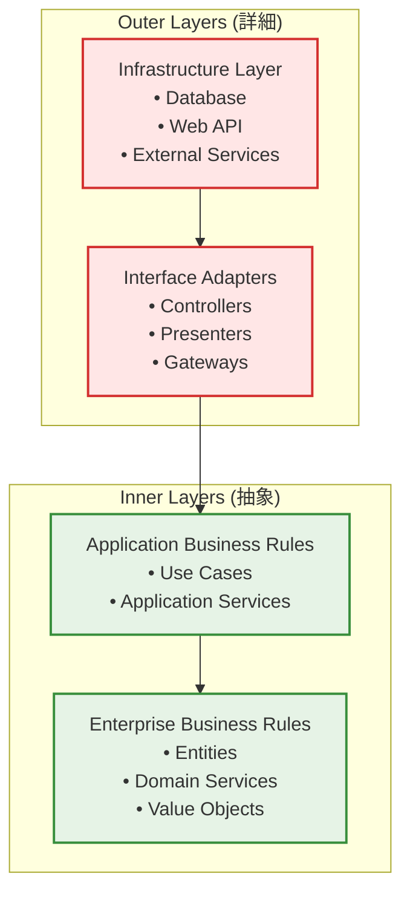

# クリーンアーキテクチャ設計原則

## 依存性逆転の原則（The Dependency Inversion Principle）

**最重要原則**: 依存性は内側だけに向かっていなければならない



## 各層の責務と依存関係

### 1. Domain Layer（最内層）
**責務**: エンタープライズビジネスルール
- **依存**: なし（完全に独立）
- **含むもの**:
  - エンティティ（Entities）
  - 値オブジェクト（Value Objects）
  - ドメインサービス（Domain Services）
  - ドメインイベント（Domain Events）

```typescript
// ❌ BAD: Domainが外部に依存
import { PrismaClient } from '@prisma/client'; // Infrastructure依存

export class Book {
  constructor(private prisma: PrismaClient) {} // NG
}

// ✅ GOOD: Domainは純粋
export class Book {
  constructor(
    private readonly id: BookId,
    private readonly title: string,
    private status: BookStatus
  ) {}
  
  updateStatus(newStatus: BookStatus): void {
    // ビジネスルールの検証
    if (!this.canUpdateTo(newStatus)) {
      throw new InvalidStatusTransitionError();
    }
    this.status = newStatus;
  }
}
```

### 2. Application Layer（ユースケース層）
**責務**: アプリケーション固有のビジネスルール
- **依存**: Domain Layer のみ
- **含むもの**:
  - ユースケース（Use Cases）
  - アプリケーションサービス
  - ポート（Ports/Interfaces）

```typescript
// ✅ GOOD: ApplicationはDomainのみに依存
export interface BookRepository { // Port
  save(book: Book): Promise<Book>;
  findById(id: BookId): Promise<Book | null>;
}

export class AddBookToLibraryUseCase {
  constructor(
    private bookRepository: BookRepository, // Interface依存（DIP）
    private userRepository: UserRepository  // Interface依存（DIP）
  ) {}
  
  async execute(command: AddBookCommand): Promise<AddBookResult> {
    // ドメインロジックの組み合わせ
    const user = await this.userRepository.findById(command.userId);
    const book = Book.create(command.bookData);
    
    user.addBookToLibrary(book); // ドメインメソッド
    
    return await this.bookRepository.save(book);
  }
}
```

### 3. Interface Adapters Layer
**責務**: データ形式の変換とフロー制御
- **依存**: Application Layer + Domain Layer
- **含むもの**:
  - コントローラー（Controllers）
  - プレゼンター（Presenters）
  - ゲートウェイ（Gateways）

```typescript
// ✅ GOOD: ControllerはUseCaseのInterfaceに依存
export class BookController {
  constructor(
    private addBookUseCase: AddBookToLibraryUseCase // UseCase依存
  ) {}
  
  async addBook(request: NextRequest): Promise<Response> {
    try {
      const command = this.mapToCommand(request); // データ変換
      const result = await this.addBookUseCase.execute(command);
      return this.mapToResponse(result); // データ変換
    } catch (error) {
      return this.handleError(error);
    }
  }
}
```

### 4. Infrastructure Layer（最外層）
**責務**: 技術的詳細の実装
- **依存**: 全ての内側の層
- **含むもの**:
  - データベース実装
  - Web API実装
  - 外部サービス連携

```typescript
// ✅ GOOD: InfrastructureはInterfaceを実装
export class PrismaBookRepository implements BookRepository {
  constructor(private prisma: PrismaClient) {}
  
  async save(book: Book): Promise<Book> {
    const data = this.mapToDatabase(book); // Domain → Database
    const result = await this.prisma.book.create({ data });
    return this.mapToDomain(result); // Database → Domain
  }
  
  async findById(id: BookId): Promise<Book | null> {
    const result = await this.prisma.book.findUnique({
      where: { id: id.value }
    });
    return result ? this.mapToDomain(result) : null;
  }
}
```

## 依存性注入（Dependency Injection）の実装

### DIコンテナの設計

```typescript
// Container.ts
export class DIContainer {
  private static instance: DIContainer;
  private services = new Map<string, any>();
  
  // Domain Services（依存なし）
  registerDomainServices(): void {
    // ドメインサービスは純粋関数として実装
  }
  
  // Application Services（Domain依存）
  registerApplicationServices(): void {
    this.services.set('addBookUseCase', new AddBookToLibraryUseCase(
      this.get('bookRepository'),
      this.get('userRepository')
    ));
  }
  
  // Infrastructure Services（全層依存可能）
  registerInfrastructureServices(): void {
    this.services.set('prisma', new PrismaClient());
    this.services.set('bookRepository', new PrismaBookRepository(
      this.get('prisma')
    ));
  }
}
```

## Next.js との統合パターン

### Server Actions での実装

```typescript
// app/actions/book-actions.ts
'use server';

import { container } from '@/infrastructure/di/container';

export async function addBookToLibrary(formData: FormData) {
  const useCase = container.get<AddBookToLibraryUseCase>('addBookUseCase');
  
  const command = {
    userId: new UserId(formData.get('userId') as string),
    bookData: {
      title: formData.get('title') as string,
      author: formData.get('author') as string,
    }
  };
  
  return await useCase.execute(command);
}
```

### API Routes での実装

```typescript
// app/api/books/route.ts
import { NextRequest } from 'next/server';
import { container } from '@/infrastructure/di/container';

export async function POST(request: NextRequest) {
  const controller = container.get<BookController>('bookController');
  return await controller.addBook(request);
}
```

## テスタビリティの向上

### Unit Testing（Domain Layer）

```typescript
// domain/entities/book.test.ts
describe('Book Entity', () => {
  it('should update status when transition is valid', () => {
    // 外部依存なしでテスト可能
    const book = new Book(
      new BookId('123'),
      'Clean Architecture',
      BookStatus.READING
    );
    
    book.updateStatus(BookStatus.COMPLETED);
    
    expect(book.status).toBe(BookStatus.COMPLETED);
  });
});
```

### Integration Testing（Application Layer）

```typescript
// application/use-cases/add-book.test.ts
describe('AddBookToLibraryUseCase', () => {
  it('should add book to user library', async () => {
    // Mockを使用してテスト
    const mockBookRepo = {
      save: jest.fn().mockResolvedValue(mockBook),
      findById: jest.fn()
    };
    
    const useCase = new AddBookToLibraryUseCase(mockBookRepo, mockUserRepo);
    const result = await useCase.execute(command);
    
    expect(mockBookRepo.save).toHaveBeenCalledWith(expect.any(Book));
  });
});
```

## メリット

1. **独立性**: 各層が明確に分離され、変更の影響が限定される
2. **テスタビリティ**: ドメインロジックを外部依存なしでテスト可能
3. **保守性**: ビジネスルールが技術的詳細から独立
4. **拡張性**: 新しい技術スタックへの移行が容易
5. **再利用性**: ドメインロジックを他のプラットフォームでも利用可能