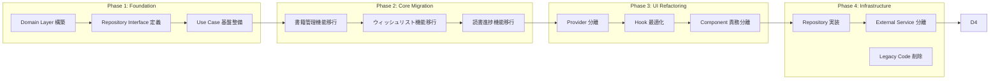

# クリーンアーキテクチャ移行計画

## 移行戦略

### Strangler Fig Pattern による段階的移行

既存システムを徐々に新しいアーキテクチャに置き換える戦略を採用します。



## Phase 1: Foundation（基盤整備）

### 1.1 新ディレクトリ構造の作成

```bash
# 新しいディレクトリ構造を並行して作成
mkdir -p src/{domain,application,infrastructure,presentation}
mkdir -p src/domain/{entities,value-objects,services,events,repositories}
mkdir -p src/application/{use-cases,ports,dto}
mkdir -p src/infrastructure/{database,external-services,web}
mkdir -p src/presentation/{components,hooks,providers}
```

### 1.2 Domain Layer の構築

**優先順位**: 最高（他の全ての層の基盤）

```typescript
// src/domain/entities/book.entity.ts
export class Book {
  constructor(
    private readonly _id: BookId,
    private readonly _title: string,
    private readonly _author: string,
    private _status: BookStatus,
    private _rating?: Rating
  ) {}

  get id(): BookId { return this._id; }
  get title(): string { return this._title; }
  get status(): BookStatus { return this._status; }

  updateStatus(newStatus: BookStatus): void {
    if (!this.canTransitionTo(newStatus)) {
      throw new InvalidStatusTransitionError(this._status, newStatus);
    }
    this._status = newStatus;
  }

  rate(rating: Rating): void {
    if (!this.canBeRated()) {
      throw new BookCannotBeRatedError(this._status);
    }
    this._rating = rating;
  }

  private canTransitionTo(newStatus: BookStatus): boolean {
    const allowedTransitions = {
      [BookStatus.WANT_TO_READ]: [BookStatus.READING, BookStatus.DNF],
      [BookStatus.READING]: [BookStatus.COMPLETED, BookStatus.DNF, BookStatus.PAUSED],
      [BookStatus.PAUSED]: [BookStatus.READING, BookStatus.DNF],
      [BookStatus.COMPLETED]: [BookStatus.READING], // 再読
      [BookStatus.DNF]: [BookStatus.READING]
    };
    return allowedTransitions[this._status]?.includes(newStatus) ?? false;
  }

  private canBeRated(): boolean {
    return this._status === BookStatus.COMPLETED;
  }
}
```

### 1.3 Value Objects の定義

```typescript
// src/domain/value-objects/book-id.vo.ts
export class BookId {
  constructor(private readonly value: string) {
    if (!value || value.trim().length === 0) {
      throw new InvalidBookIdError(value);
    }
  }

  getValue(): string { return this.value; }
  
  equals(other: BookId): boolean {
    return this.value === other.value;
  }
}

// src/domain/value-objects/rating.vo.ts
export class Rating {
  constructor(private readonly value: number) {
    if (value < 1 || value > 5 || !Number.isInteger(value)) {
      throw new InvalidRatingError(value);
    }
  }

  getValue(): number { return this.value; }
  
  isHighRating(): boolean { return this.value >= 4; }
}
```

### 1.4 Repository Interfaces の定義

```typescript
// src/domain/repositories/book.repository.ts
export interface BookRepository {
  save(book: Book): Promise<Book>;
  findById(id: BookId): Promise<Book | null>;
  findByUserId(userId: UserId): Promise<Book[]>;
  findByStatus(userId: UserId, status: BookStatus): Promise<Book[]>;
  delete(id: BookId): Promise<void>;
}

// src/domain/repositories/user.repository.ts
export interface UserRepository {
  findById(id: UserId): Promise<User | null>;
  save(user: User): Promise<User>;
}
```

## Phase 2: Core Migration（コア機能移行）

### 2.1 Use Cases の実装

```typescript
// src/application/use-cases/book/add-book-to-library.use-case.ts
export class AddBookToLibraryUseCase {
  constructor(
    private bookRepository: BookRepository,
    private userRepository: UserRepository,
    private googleBooksService: GoogleBooksService
  ) {}

  async execute(command: AddBookToLibraryCommand): Promise<AddBookToLibraryResult> {
    // 1. ユーザー存在確認
    const user = await this.userRepository.findById(command.userId);
    if (!user) {
      throw new UserNotFoundError(command.userId);
    }

    // 2. 書籍情報の取得・補完
    let bookData = command.bookData;
    if (command.googleBooksId) {
      const googleBookData = await this.googleBooksService.getBookById(command.googleBooksId);
      bookData = { ...bookData, ...googleBookData };
    }

    // 3. ドメインエンティティの作成
    const book = Book.create({
      title: bookData.title,
      author: bookData.author,
      status: BookStatus.WANT_TO_READ,
      userId: command.userId
    });

    // 4. 重複チェック
    const existingBooks = await this.bookRepository.findByUserId(command.userId);
    if (existingBooks.some(b => b.isSameBook(book))) {
      throw new DuplicateBookError(book.title);
    }

    // 5. 保存
    const savedBook = await this.bookRepository.save(book);

    return {
      book: savedBook,
      success: true
    };
  }
}
```

### 2.2 既存機能の段階的置き換え

**Step 1**: 新しいUse Caseを並行実装
**Step 2**: 既存のServer Actionから新しいUse Caseを呼び出し
**Step 3**: 既存のロジックを削除

```typescript
// 既存: app/actions/books.ts (移行中)
export async function addBookToLibrary(formData: FormData) {
  // 新しいUse Caseを使用（移行中）
  const container = DIContainer.getInstance();
  const useCase = container.get<AddBookToLibraryUseCase>('addBookToLibraryUseCase');
  
  const command = {
    userId: new UserId(formData.get('userId') as string),
    bookData: {
      title: formData.get('title') as string,
      author: formData.get('author') as string,
    }
  };
  
  return await useCase.execute(command);
}
```

## Phase 3: UI Refactoring（UI層リファクタリング）

### 3.1 Provider の責務分離

**Before**: LibraryProvider が全責務を持つ

```typescript
// 既存: app/protected/components/LibraryProvider.tsx
// 問題: 状態管理、API呼び出し、UI制御を全て担当
```

**After**: 責務別に分離

```typescript
// src/presentation/providers/book-state.provider.tsx
export const BookStateProvider = ({ children }: { children: React.ReactNode }) => {
  const [books, setBooks] = useState<Book[]>([]);
  const [loading, setLoading] = useState(false);
  
  // 状態管理のみに集中
  const value = {
    books,
    setBooks,
    loading,
    setLoading
  };
  
  return <BookStateContext.Provider value={value}>{children}</BookStateContext.Provider>;
};

// src/presentation/hooks/use-book-actions.ts
export const useBookActions = () => {
  const container = DIContainer.getInstance();
  
  return {
    addBook: useMutation({
      mutationFn: (command: AddBookToLibraryCommand) => {
        const useCase = container.get<AddBookToLibraryUseCase>('addBookToLibraryUseCase');
        return useCase.execute(command);
      }
    }),
    updateStatus: useMutation({
      mutationFn: (command: UpdateBookStatusCommand) => {
        const useCase = container.get<UpdateBookStatusUseCase>('updateBookStatusUseCase');
        return useCase.execute(command);
      }
    })
  };
};
```

### 3.2 Component の責務明確化

```typescript
// src/presentation/components/features/library/book-card.component.tsx
interface BookCardProps {
  book: Book; // Domainエンティティを直接使用
  onStatusUpdate: (bookId: BookId, status: BookStatus) => void;
  onRate: (bookId: BookId, rating: Rating) => void;
}

export const BookCard: React.FC<BookCardProps> = ({ book, onStatusUpdate, onRate }) => {
  // UI描画のみに集中
  return (
    <Card>
      <CardHeader>
        <CardTitle>{book.title}</CardTitle>
        <CardDescription>{book.author}</CardDescription>
      </CardHeader>
      <CardContent>
        <BookStatusBadge status={book.status} />
        {book.rating && <RatingDisplay rating={book.rating} />}
      </CardContent>
      <CardActions>
        <BookStatusSelector 
          currentStatus={book.status}
          onStatusChange={(status) => onStatusUpdate(book.id, status)}
        />
        {book.canBeRated() && (
          <RatingSelector onRate={(rating) => onRate(book.id, rating)} />
        )}
      </CardActions>
    </Card>
  );
};
```

## Phase 4: Infrastructure Implementation（インフラ実装）

### 4.1 Repository 実装の移行

```typescript
// src/infrastructure/database/repositories/prisma-book.repository.ts
export class PrismaBookRepository implements BookRepository {
  constructor(private prisma: PrismaClient) {}

  async save(book: Book): Promise<Book> {
    const data = BookMapper.toPersistence(book);
    
    if (await this.exists(book.id)) {
      const updated = await this.prisma.book.update({
        where: { id: book.id.getValue() },
        data
      });
      return BookMapper.toDomain(updated);
    } else {
      const created = await this.prisma.book.create({ data });
      return BookMapper.toDomain(created);
    }
  }

  async findById(id: BookId): Promise<Book | null> {
    const book = await this.prisma.book.findUnique({
      where: { id: id.getValue() }
    });
    return book ? BookMapper.toDomain(book) : null;
  }

  private async exists(id: BookId): Promise<boolean> {
    const count = await this.prisma.book.count({
      where: { id: id.getValue() }
    });
    return count > 0;
  }
}
```

### 4.2 Data Mapper の実装

```typescript
// src/infrastructure/database/mappers/book.mapper.ts
export class BookMapper {
  static toDomain(persistence: PrismaBook): Book {
    return new Book(
      new BookId(persistence.id),
      persistence.title,
      persistence.author,
      BookStatus[persistence.status as keyof typeof BookStatus],
      persistence.rating ? new Rating(persistence.rating) : undefined
    );
  }

  static toPersistence(domain: Book): PrismaBookCreateInput {
    return {
      id: domain.id.getValue(),
      title: domain.title,
      author: domain.author,
      status: domain.status,
      rating: domain.rating?.getValue(),
      userId: domain.userId.getValue()
    };
  }
}
```

## 移行スケジュール

### Week 1-2: Phase 1（基盤整備）
- [ ] ディレクトリ構造作成
- [ ] Domain Entities 実装
- [ ] Value Objects 実装
- [ ] Repository Interfaces 定義

### Week 3-4: Phase 2（コア機能移行）
- [ ] AddBookToLibrary UseCase 実装
- [ ] UpdateBookStatus UseCase 実装
- [ ] GetUserBooks UseCase 実装
- [ ] 既存 Server Actions の置き換え

### Week 5-6: Phase 3（UI リファクタリング）
- [ ] LibraryProvider 分離
- [ ] カスタムフック実装
- [ ] Component 責務分離

### Week 7-8: Phase 4（インフラ完成）
- [ ] Repository 実装
- [ ] External Service 分離
- [ ] Legacy Code 削除
- [ ] テスト整備

## リスク軽減策

### 1. 既存機能の継続性保証
- 新旧実装の並行稼働
- フィーチャーフラグによる切り替え制御
- 段階的ロールバック計画

### 2. パフォーマンス影響の最小化
- 移行中のオーバーヘッド監視
- キャッシュ戦略の見直し
- データベースクエリ最適化

### 3. チーム学習コスト
- アーキテクチャ勉強会の実施
- コードレビューガイドライン策定
- ペアプログラミングによる知識共有