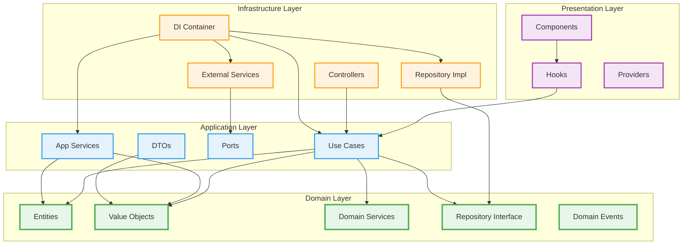

# 新しいディレクトリ構造

## 完全なディレクトリ構造

```
hontodana/
├── app/                           # Next.js App Router (Framework Layer)
│   ├── api/                       # API Routes (Interface Adapters)
│   ├── auth/                      # 認証ページ
│   ├── protected/                 # 保護されたページ
│   └── actions/                   # Server Actions (Interface Adapters)
├── src/                           # 新しいクリーンアーキテクチャ
│   ├── domain/                    # Domain Layer (最内層)
│   │   ├── entities/              # エンティティ
│   │   │   ├── book.entity.ts
│   │   │   ├── user.entity.ts
│   │   │   ├── wishlist.entity.ts
│   │   │   └── reading-progress.entity.ts
│   │   ├── value-objects/         # 値オブジェクト
│   │   │   ├── book-id.vo.ts
│   │   │   ├── user-id.vo.ts
│   │   │   ├── rating.vo.ts
│   │   │   ├── progress.vo.ts
│   │   │   └── book-status.vo.ts
│   │   ├── services/              # ドメインサービス
│   │   │   ├── reading-stats.domain-service.ts
│   │   │   └── duplicate-book-checker.domain-service.ts
│   │   ├── repositories/          # Repository インターフェース
│   │   │   ├── book.repository.ts
│   │   │   ├── user.repository.ts
│   │   │   ├── wishlist.repository.ts
│   │   │   └── reading-progress.repository.ts
│   │   ├── events/                # ドメインイベント
│   │   │   ├── book-added.event.ts
│   │   │   ├── book-completed.event.ts
│   │   │   └── reading-progress-updated.event.ts
│   │   └── errors/                # ドメインエラー
│   │       ├── book.errors.ts
│   │       ├── user.errors.ts
│   │       └── common.errors.ts
│   ├── application/               # Application Layer (ユースケース層)
│   │   ├── use-cases/             # ユースケース
│   │   │   ├── book/
│   │   │   │   ├── add-book-to-library.use-case.ts
│   │   │   │   ├── get-user-books.use-case.ts
│   │   │   │   ├── update-book-status.use-case.ts
│   │   │   │   ├── remove-book.use-case.ts
│   │   │   │   └── rate-book.use-case.ts
│   │   │   ├── wishlist/
│   │   │   │   ├── add-to-wishlist.use-case.ts
│   │   │   │   ├── move-to-library.use-case.ts
│   │   │   │   └── remove-from-wishlist.use-case.ts
│   │   │   ├── reading-progress/
│   │   │   │   ├── update-progress.use-case.ts
│   │   │   │   └── get-progress-stats.use-case.ts
│   │   │   └── dashboard/
│   │   │       ├── get-reading-stats.use-case.ts
│   │   │       └── get-dashboard-data.use-case.ts
│   │   ├── ports/                 # ポート（インターフェース）
│   │   │   ├── repositories/      # Repository インターフェース（再エクスポート）
│   │   │   └── services/          # 外部サービスインターフェース
│   │   │       ├── google-books.service.ts
│   │   │       ├── notification.service.ts
│   │   │       └── export.service.ts
│   │   ├── dto/                   # Data Transfer Objects
│   │   │   ├── book.dto.ts
│   │   │   ├── user.dto.ts
│   │   │   ├── commands/
│   │   │   │   ├── add-book.command.ts
│   │   │   │   ├── update-status.command.ts
│   │   │   │   └── update-progress.command.ts
│   │   │   └── results/
│   │   │       ├── add-book.result.ts
│   │   │       ├── book-list.result.ts
│   │   │       └── dashboard.result.ts
│   │   └── services/              # アプリケーションサービス
│   │       ├── book-application.service.ts
│   │       └── dashboard-application.service.ts
│   ├── infrastructure/            # Infrastructure Layer (最外層)
│   │   ├── database/              # データベース関連
│   │   │   ├── prisma/
│   │   │   │   ├── schema.prisma
│   │   │   │   └── client.ts
│   │   │   ├── repositories/      # Repository 実装
│   │   │   │   ├── prisma-book.repository.ts
│   │   │   │   ├── prisma-user.repository.ts
│   │   │   │   ├── prisma-wishlist.repository.ts
│   │   │   │   └── prisma-reading-progress.repository.ts
│   │   │   └── mappers/           # データマッパー
│   │   │       ├── book.mapper.ts
│   │   │       ├── user.mapper.ts
│   │   │       └── wishlist.mapper.ts
│   │   ├── external-services/     # 外部サービス
│   │   │   ├── google-books/
│   │   │   │   ├── google-books.service.ts
│   │   │   │   ├── google-books.client.ts
│   │   │   │   └── google-books.mapper.ts
│   │   │   ├── supabase/
│   │   │   │   ├── supabase.client.ts
│   │   │   │   └── auth.service.ts
│   │   │   └── notification/
│   │   │       └── notification.service.ts
│   │   ├── web/                   # Web関連
│   │   │   ├── controllers/       # コントローラー
│   │   │   │   ├── book.controller.ts
│   │   │   │   ├── dashboard.controller.ts
│   │   │   │   └── wishlist.controller.ts
│   │   │   ├── middleware/        # ミドルウェア
│   │   │   │   ├── auth.middleware.ts
│   │   │   │   └── error.middleware.ts
│   │   │   └── mappers/           # DTO マッパー
│   │   │       ├── request.mapper.ts
│   │   │       └── response.mapper.ts
│   │   ├── config/                # 設定
│   │   │   ├── database.config.ts
│   │   │   ├── external-services.config.ts
│   │   │   └── environment.config.ts
│   │   └── di/                    # 依存性注入
│   │       ├── container.ts
│   │       ├── book.module.ts
│   │       ├── dashboard.module.ts
│   │       └── infrastructure.module.ts
│   └── presentation/              # Presentation Layer
│       ├── components/            # Reactコンポーネント
│       │   ├── ui/               # 汎用UIコンポーネント
│       │   ├── features/         # フィーチャー別コンポーネント
│       │   │   ├── library/
│       │   │   │   ├── book-card.component.tsx
│       │   │   │   ├── book-list.component.tsx
│       │   │   │   └── library.component.tsx
│       │   │   ├── dashboard/
│       │   │   │   ├── reading-stats.component.tsx
│       │   │   │   ├── progress-chart.component.tsx
│       │   │   │   └── dashboard.component.tsx
│       │   │   ├── search/
│       │   │   │   ├── search-form.component.tsx
│       │   │   │   └── search-results.component.tsx
│       │   │   └── wishlist/
│       │   │       ├── wishlist-card.component.tsx
│       │   │       └── wishlist.component.tsx
│       │   └── shared/           # 共有コンポーネント
│       │       ├── book-status-badge.component.tsx
│       │       ├── rating-display.component.tsx
│       │       └── progress-bar.component.tsx
│       ├── hooks/                # カスタムフック
│       │   ├── use-book-actions.ts
│       │   ├── use-dashboard-data.ts
│       │   ├── use-reading-progress.ts
│       │   └── use-wishlist-actions.ts
│       ├── providers/            # Context Providers
│       │   ├── book-state.provider.tsx
│       │   ├── dashboard-state.provider.tsx
│       │   └── notification.provider.tsx
│       └── utils/                # プレゼンテーション層ユーティリティ
│           ├── formatters.ts
│           └── validators.ts
├── __tests__/                    # テスト
│   ├── domain/                   # ドメインテスト
│   ├── application/              # アプリケーションテスト
│   ├── infrastructure/           # インフラテスト
│   └── presentation/             # プレゼンテーションテスト
└── docs/                         # ドキュメント
    ├── transfer_clean_architecture/
    └── ...existing docs
```

## 依存関係の流れ



## ファイル命名規則

### ドメイン層
- **エンティティ**: `*.entity.ts`
- **値オブジェクト**: `*.vo.ts`
- **ドメインサービス**: `*.domain-service.ts`
- **Repository Interface**: `*.repository.ts`
- **ドメインイベント**: `*.event.ts`
- **ドメインエラー**: `*.errors.ts`

### アプリケーション層
- **ユースケース**: `*.use-case.ts`
- **アプリケーションサービス**: `*.application-service.ts`
- **コマンド**: `*.command.ts`
- **結果**: `*.result.ts`
- **DTO**: `*.dto.ts`

### インフラストラクチャ層
- **Repository実装**: `prisma-*.repository.ts`
- **外部サービス**: `*.service.ts`
- **データマッパー**: `*.mapper.ts`
- **コントローラー**: `*.controller.ts`
- **DIモジュール**: `*.module.ts`

### プレゼンテーション層
- **コンポーネント**: `*.component.tsx`
- **フック**: `use-*.ts`
- **プロバイダー**: `*.provider.tsx`

## モジュール構成

### Domain Modules

```typescript
// src/domain/entities/index.ts
export { Book } from './book.entity';
export { User } from './user.entity';
export { Wishlist } from './wishlist.entity';
export { ReadingProgress } from './reading-progress.entity';

// src/domain/value-objects/index.ts
export { BookId } from './book-id.vo';
export { UserId } from './user-id.vo';
export { Rating } from './rating.vo';
export { Progress } from './progress.vo';
export { BookStatus } from './book-status.vo';

// src/domain/index.ts
export * from './entities';
export * from './value-objects';
export * from './services';
export * from './repositories';
export * from './events';
export * from './errors';
```

### Application Modules

```typescript
// src/application/use-cases/book/index.ts
export { AddBookToLibraryUseCase } from './add-book-to-library.use-case';
export { GetUserBooksUseCase } from './get-user-books.use-case';
export { UpdateBookStatusUseCase } from './update-book-status.use-case';
export { RemoveBookUseCase } from './remove-book.use-case';
export { RateBookUseCase } from './rate-book.use-case';

// src/application/index.ts
export * from './use-cases';
export * from './dto';
export * from './ports';
export * from './services';
```

### Infrastructure Modules

```typescript
// src/infrastructure/database/repositories/index.ts
export { PrismaBookRepository } from './prisma-book.repository';
export { PrismaUserRepository } from './prisma-user.repository';
export { PrismaWishlistRepository } from './prisma-wishlist.repository';
export { PrismaReadingProgressRepository } from './prisma-reading-progress.repository';

// src/infrastructure/index.ts
export * from './database';
export * from './external-services';
export * from './web';
export * from './config';
export * from './di';
```

### Presentation Modules

```typescript
// src/presentation/components/features/library/index.ts
export { BookCard } from './book-card.component';
export { BookList } from './book-list.component';
export { Library } from './library.component';

// src/presentation/hooks/index.ts
export { useBookActions } from './use-book-actions';
export { useDashboardData } from './use-dashboard-data';
export { useReadingProgress } from './use-reading-progress';
export { useWishlistActions } from './use-wishlist-actions';

// src/presentation/index.ts
export * from './components';
export * from './hooks';
export * from './providers';
export * from './utils';
```

## パッケージ構成

### package.json の更新

```json
{
  "scripts": {
    "build:domain": "tsc --project src/domain/tsconfig.json",
    "build:application": "tsc --project src/application/tsconfig.json",
    "build:infrastructure": "tsc --project src/infrastructure/tsconfig.json",
    "build:presentation": "tsc --project src/presentation/tsconfig.json",
    "test:domain": "jest src/domain",
    "test:application": "jest src/application",
    "test:infrastructure": "jest src/infrastructure",
    "test:presentation": "jest src/presentation",
    "test:architecture": "jest __tests__/architecture"
  }
}
```

### tsconfig.json の更新

```json
{
  "compilerOptions": {
    "baseUrl": ".",
    "paths": {
      "@/*": ["./app/*"],
      "@/domain/*": ["./src/domain/*"],
      "@/application/*": ["./src/application/*"],
      "@/infrastructure/*": ["./src/infrastructure/*"],
      "@/presentation/*": ["./src/presentation/*"]
    }
  },
  "include": [
    "next-env.d.ts",
    "**/*.ts",
    "**/*.tsx",
    "src/**/*"
  ]
}
```

このディレクトリ構造により、依存性逆転の原則に従った保守しやすいクリーンアーキテクチャを実現できます。